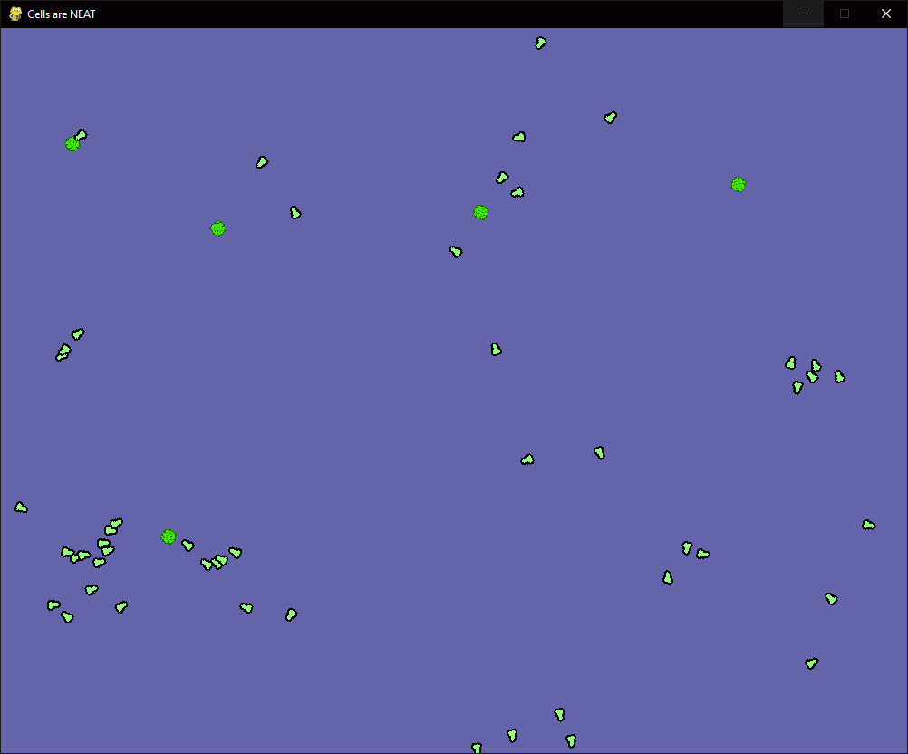
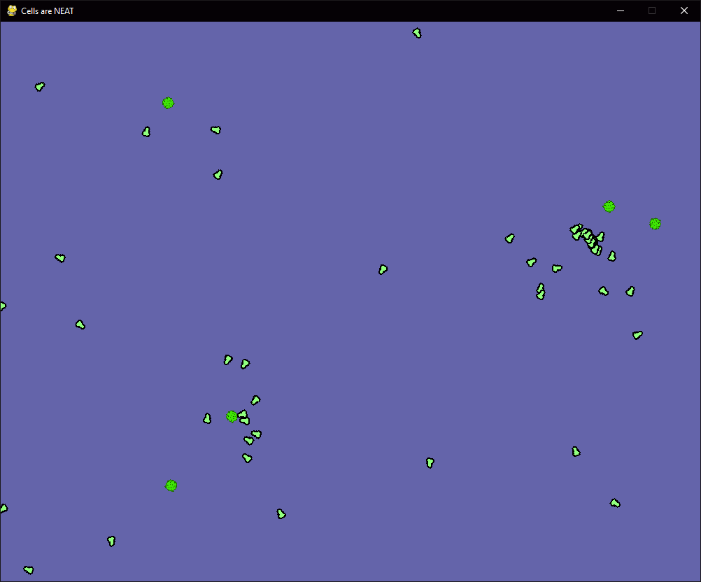

# Cells are NEAT

Several for-fun experiments using NeuroEvolution of Augmenting Topologies (https://ieeexplore.ieee.org/abstract/document/6790655). This technique makes use of random brain networks for the to-be-trained agents, and through an evolutionary algorithm works towards more and more effective agents. The code is still very much work in progress; I want to, once I am done with my thesis, extend the library used for NEAT to support mutiple chromosomes. This will allow for co-evolution of both cell behavior and cell properties at once. What is relatively finished are two earlier attempts, also in this repository.

Attempt 1 (in the _\_gradient\_cells_ folder) tried to get small cells to move around and follow a gradient, which I could not get to work convincingly.

Attempt 2 (in the _\_herbivores_ folder) was more succesful. Here cells were tasked with moving around in order to grab pieces of food floating in the world. This worked very well, as can be seen here:

